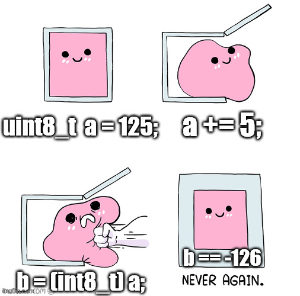

I believe the most common mistake I see in both new and experienced users of C
is incorrect or dangerous integer casting. It appears to me that these troubled
developers are equating casting to conversion without realizing they're
introducing bugs into their software. I'm unsure if this is because of lack of
knowledge, laziness, or forgetfulness due to working in higher-level languages,
but whatever the reason I see it often (and I'm guilty of it too!).



## The problem

Let's look at an example to get started.

```c
#include <stdio.h>
#include <stdint.h>
#include <limits.h>

uint16_t a = 100;
int16_t b = (int16_t)a;
printf("a = %u b = %d\n", a, b);
// a = 100 b = 100
```

The above does what we expect. We're casting an unsigned to a signed, but
since the number is still within the bounds of the signed value, it works as
expected.

```c
uint16_t a = INT16_MAX;
int16_t b = (int16_t)a;
printf("a = %u b = %d\n", a, b);
// a = 32767 b = 32767
```

Even with the `INT16_MAX` value, the cast still works fine, no bugs here, but
what happens if we add `1` to that number?

```c
uint16_t a = INT16_MAX + 1;
int16_t b = (int16_t)a;
printf("a = %u b = %d\n", a, b);
// a = 32768 b = -32768
```

Wow, it goes negative! Why is that happening if `a` was a positive number? Most
people I question about this figure a cast like this would just clamp `a` to
`b`'s highest positive value, but this is clearly not true. This is the major
(and bug-inducing) difference between a cast and a conversion.

A cast is not elegant. There is no validation being done for you (and why would
it? Since when has C ever done anything for you?). A cast literally chops bits
off and slams them into a box. A cast is when have your friend sit on your
suitcase, so you can jam in one more outfit for your trip -- it'll close, but
you might end up with a shirt cut up by the zipper.

Let's [look at these numbers bit-by-bit](https://bitwisecmd.com/). These
numbers are represented in their unsigned form.

```plaintext
unsigned        bits          hex
-----------------------------------
100       00000000 01100100  0x0064
32767     01111111 11111111  0x7fff
32768     10000000 00000000  0x8000
```

And now let's annotate our source with what's actually being set in memory.

```c
uint16_t a = INT16_MAX + 1;  // a = 10000000 00000000
int16_t b = (int16_t)a;      // b = 10000000 00000000
printf("a = %u b = %d\n", a, b);
// a = 32768 b = -32768
```

What we're seeing here is because the MSB of `b`'s `32768` is `1` this tells
the computer this is actually a negative number (as long as it's treated as
signed which `printf` is doing). This system of storing negative numbers is
called [two's complement](https://en.wikipedia.org/wiki/Two%27s_complement).
The takeaway here is a cast does not care if it's going from unsigned to
signed, nor does it care if it's going from a wider container to a narrower
one.

Casting is not only dangerous when casting from unsigned to signed, it can be
dangerous when casting from a wider container to a narrower one. Here's an
example which shows casting is like a guillotine, and we lose data permanently.

```c
int16_t a = -32768;   // a = 10000000 00000000
int8_t b = (int8_t)a; // b =          00000000
printf("a = %d b = %d\n", a, b);
// a = -32768 b = 0
```

```c
int16_t a = -32768 + 20; // a = 10000000 00010100
int8_t b = (int8_t)a;    // b =          00010100
printf("a = %d b = %d\n", a, b);
// a = -32748 b = 20
```

### Thanks Microsoft

I have a real-world example which I have seen too many times. The problem
is mostly Microsoft's fault for creating a POSIX named function which is not
POSIX compliant.

POSIX declares the `write()` function as such:

```c
// POSIX
ssize_t write(int fd, const void *buf, size_t count);
```

And Microsoft's implementation of
[write()](https://docs.microsoft.com/en-us/cpp/c-runtime-library/reference/posix-write?view=msvc-140)
is:

```c
// Microsoft
int write(int fd, const void *buffer, unsigned int count);
```

The problematic usage I often see is in usages like this:

```c
ssize_t write_data(int in_fd, const char * in_buffer, size_t in_count) {
    #ifdef _WIN32
        return (ssize_t)write(in_fd, in_buffer, (unsigned int)in_count);
    #else
        return write(in_fd, in_buffer, in_count);
    #endif
}
```

We can see that there's a very real chance `in_count` will be bigger than
the max value of `unsigned int`. On both 32 and 64-bit Windows, `int` is
32-bits wide. On 32-bit Windows `size_t` is 32-bits wide and on 64-bit Windows
`size_t` is 64-bits wide. So this incorrect cast will not only lead to
interoperability between Windows and Linux but also between 32/64-bit Windows.

## The solution

The steps to perform proper conversion are not magic, they're exactly what you
may expect. Basically all you really need is bounds checking. The resulting
code will be exhaustive, but that's what C is.

1. When converting from signed to signed or unsigned to unsigned, simply ensure
  the receiving container is of the same width or larger. If the resulting
  container is smaller then check for out-of-bounds input values and clamp
  or error depending on your situation.
1. When signs differ (signed to unsigned, and reverse), you must properly
  validate the bounds of the receiving container, even if larger, and the
  sign of the source value.
1. There are apparently some systems where zero (`0x00`, `0b00000000`) in
  memory does not actually mean zero (`0`) in value. I don't know of any of
  these systems, but I figure it would be wrong of me to not pass on the
  paranoia. In these instances you'll need to perform more complex conversions.
  I will leave this as an exercise for the reader (  ).

```c
ssize_t write_data(int in_fd, const char * in_buffer, size_t in_count) {
    #ifdef _WIN32
        // clamp
        unsigned int win_count = in_count > UINT_MAX ? UINT_MAX : (unsigned int)in_count;
        return (ssize_t)write(in_fd, in_buffer, win_count);
    #else
        return write(in_fd, in_buffer, in_count);
    #endif
}
```

That's a somewhat simple example where clamping `in_count` to a max value
will not produce adverse functionality (because `write` has no guarantee
it will write the entire buffer passed in). If the function was supposed to
be an all-or-nothing write, then we'd have to if `in_count > UINT_MAX`
(and... you know... also not use `write`).

Also, it should be
[compile-time verified](https://stackoverflow.com/a/18511691/721519) that
`sizeof(int) <= sizeof(ssize_t)` to ensure the `return` cast is always
compliant.

## Overflows, underflows, and wraparounds

This is a topic that deserves its own article, but I would be doing a
disservice to you if I also did not warn about integer overflow, underflows,
and wraparounds since they are important to understand when tackling casting.

In short, `x + 1 > x` is not always true.

What happens when you set an unsigned number to `-1` or set a value bigger than
the container can store (like 500 to a `uint8_t`)? For unsigned numbers they
wraparound, meaning setting `uint8_t  a = -1;` will make `a == 255` and
`uint8_t  a = 256;` will make `a == 0`.

With signed numbers (like `int8_t`), essentially the same thing happens on
most systems, but the C standard says overflows and underflows are undefined
for signed values (meaning the compiler is allowed to error and/or the result
does not have to abide by any rules).

I'm bringing this up because it's important to remember that when casting
to narrower storage, your range of legal values changes. By performing
arithmetic you can very easily blow out the maximum storage of your containers.

The below example is a continuation of our `write_data()` function with an
added argument of `in_repeat` which will call `write_data()` recursively if
greater than `0`.

Eventually, if given a large enough buffer and repeat number, the return
value of `write_data` could end up in the negatives (or more appropriately, in
undefined behavior) which would cause the final line of
`return result + recursive_result;` to actually de-increment the returning
number.

```c
ssize_t write_data(int in_fd, const char * in_buffer, size_t in_count, size_t in_repeat) {
    ssize_t result;
    #ifdef _WIN32
        // clamp
        unsigned int win_count = in_count > UINT_MAX ? UINT_MAX : (unsigned int)in_count;
        result = (ssize_t)write(in_fd, in_buffer, win_count);
    #else
        result = write(in_fd, in_buffer, in_count);
    #endif

    if (-1 == result || 0 == in_repeat) {
        // error or no more recursion
        return result;
    }

    ssize_t recursive_result = write_data(in_fd, in_buffer, in_count, in_repeat - 1);
    if (-1 == recursive_result) {
        return result;
    }
    // Oh no! `result + recursive_result` can easily overflow the size of
    // `ssize_t` after only a few recursive loops.
    return result + recursive_result;
}
```

I'll admit that's not the best example, but if you are indeed my target
audience, I hopefully just dropped a little extra knowledge on you.

I have found a nice article titled
[Integer Overflow Prevention in C](https://splone.com/blog/2015/3/11/integer-overflow-prevention-in-c/)
which goes into far deeper explanation than I have.

## Summary

In summary, C has many places where it bites back. Common operations in C are
often much more dangerous than they seem. This does not make C a bad language,
as there are still many goods, but it does explain why so many have moved away
from C into "safer" languages. For those in the back who are jumping up and
down screaming, "Just use Rust!", I do want to note that Rust still suffers
from integer wraparounds (however, there are functions in Rust's standard
library which may be used to
[gracefully deal with wraparounds](https://huonw.github.io/blog/2016/04/myths-and-legends-about-integer-overflow-in-rust/#myth-the-programmer-has-no-control-of-overflow-handling)).

## Related external readings

- [Safe Integer Conversion in C](http://tzimmermann.org/2018/04/20/safe-integer-conversion-in-c/)
  - From the above, [picotm's casting macro][https://github.com/picotm/picotm/blob/master/modules/cast/include/picotm/picotm-cast.h#L66]
- [Integer Overflow Prevention in C](https://splone.com/blog/2015/3/11/integer-overflow-prevention-in-c/)
- [Undefined behavior can result in time travel (among other things, but time travel is the funkiest)](https://devblogs.microsoft.com/oldnewthing/20140627-00/?p=633)
- How a variable can be both true and false at the same time:
  [Both true and false: a Zen moment with C](https://markshroyer.com/2012/06/c-both-true-and-false/)
